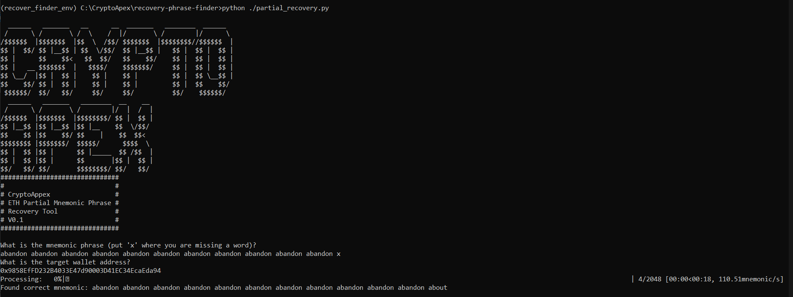

# Eth Partial Mnemonic Recovery Phrase Finder

```bash
  ______   _______   __      __  _______   ________  ______
 /      \ /       \ /  \    /  |/       \ /        |/      \
/$$$$$$  |$$$$$$$  |$$  \  /$$/ $$$$$$$  |$$$$$$$$//$$$$$$  |
$$ |  $$/ $$ |__$$ | $$  \/$$/  $$ |__$$ |   $$ |  $$ |  $$ |
$$ |      $$    $$<   $$  $$/   $$    $$/    $$ |  $$ |  $$ |
$$ |   __ $$$$$$$  |   $$$$/    $$$$$$$/     $$ |  $$ |  $$ |
$$ \__/  |$$ |  $$ |    $$ |    $$ |         $$ |  $$ \__$$ |
$$    $$/ $$ |  $$ |    $$ |    $$ |         $$ |  $$    $$/
 $$$$$$/  $$/   $$/     $$/     $$/          $$/    $$$$$$/
  ______   _______   ________  __    __
 /      \ /       \ /        |/  |  /  |
/$$$$$$  |$$$$$$$  |$$$$$$$$/ $$ |  $$ |
$$ |__$$ |$$ |__$$ |$$ |__    $$  \/$$/
$$    $$ |$$    $$/ $$    |    $$  $$<
$$$$$$$$ |$$$$$$$/  $$$$$/      $$$$  \
$$ |  $$ |$$ |      $$ |_____  $$ /$$  |
$$ |  $$ |$$ |      $$       |$$ |  $$ |
$$/   $$/ $$/       $$$$$$$$/ $$/   $$/

###############################
#                             #
#         CryptoApex          #
# ETH Partial Mnemonic Phrase #
#        Recovery Tool        #
#            V0.1             #
#                             #
###############################
```

**Recovery Phrase Finder** is a tool for recovering Ethereum mnemonic phrases. This script attempts to find a valid 12-word mnemonic phrase by filling in placeholders (`x`) and checks if the resulting mnemonic produces a target Ethereum address.

Telegram:
https://t.me/vertexapex_hub

Discord:
https://discord.gg/P265G7Ex

## Features

- **Mnemonic Phrase Recovery**: Given a partial mnemonic phrase with placeholders, the tool tries all possible combinations from a word list.
- **Ethereum Address Validation**: Checks if the resulting mnemonic generates the specified Ethereum address.
- **Progress Tracking**: Displays a live progress bar while searching for the correct mnemonic.

## TODOs

- **Search without a target address**: Add option to scan for balance rather than a specific address
- **Code optimization**: Improve the speed for a faster Mnemonic/s

## Setup

### Prerequisites

Ensure you have Python 3.8 or later installed on your system.

### Installation

1. **Clone the repository:**

   ```bash
   git clone https://github.com/CryptoApex23/recovery-phrase-finder.git
   cd recovery-phrase-finder
   ```

2. **Create and activate a virtual environment:**

   ```bash
   $python -m venv venv        # Or python3
   $source venv/bin/activate   # On Windows, use `$venv\Scripts\activate`
   ```

3. **Install the required packages:**

   ```bash
   pip install -r requirements.txt  # Or pip3
   ```

## Usage

1. **Prepare a word list file:**

   Ensure you have a `wordlist.txt` file with one word per line. This file is used to generate mnemonic combinations.

2. **Run the script:**

   ```bash
   python partial_recovery.py # Or python3
   ```

3. **Follow the prompts:**

   - Enter the partial mnemonic phrase with `x` as placeholders for missing words.
   - Enter the target Ethereum address.

   Example input:

   ```
   What is the mnemonic phrase (put 'x' where you are missing a word)?
   tornado glass tribe limit talent festival soup helmet brass elevator test x
   What is the target wallet address?
   0xYourTargetEthereumAddressHere
   ```

   The script will try all possible combinations and display the correct mnemonic phrase if found.

## Example



## Troubleshooting

- **Invalid Mnemonic Phrase**: Ensure your mnemonic phrase has exactly 12 words with `x` placeholders.
- **Invalid Ethereum Address**: Make sure you provide a valid Ethereum address.

## Contributing

Feel free to fork the repository, make improvements, and submit pull requests. Contributions are welcome!

## Donation

Help me keep the light on and maintane all the projects <3

BTC

```bash
bc1qxwlpy6fx33e968uqhw7pr030kvyr3pel0ptxt3
```

ETH

```bash
0x8a530A5eC57d7D7944E23Ffc5D85dA09c52C8eda
```

SOL

```bash
FCfyeS5LwsjjgGiJKAikYFwPoweBcVLYASjRstEhHaAs
```

## License

This project is licensed under the MIT License. See the [LICENSE](LICENSE) file for details.
